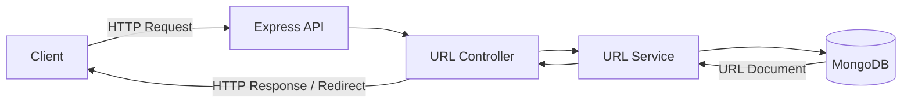
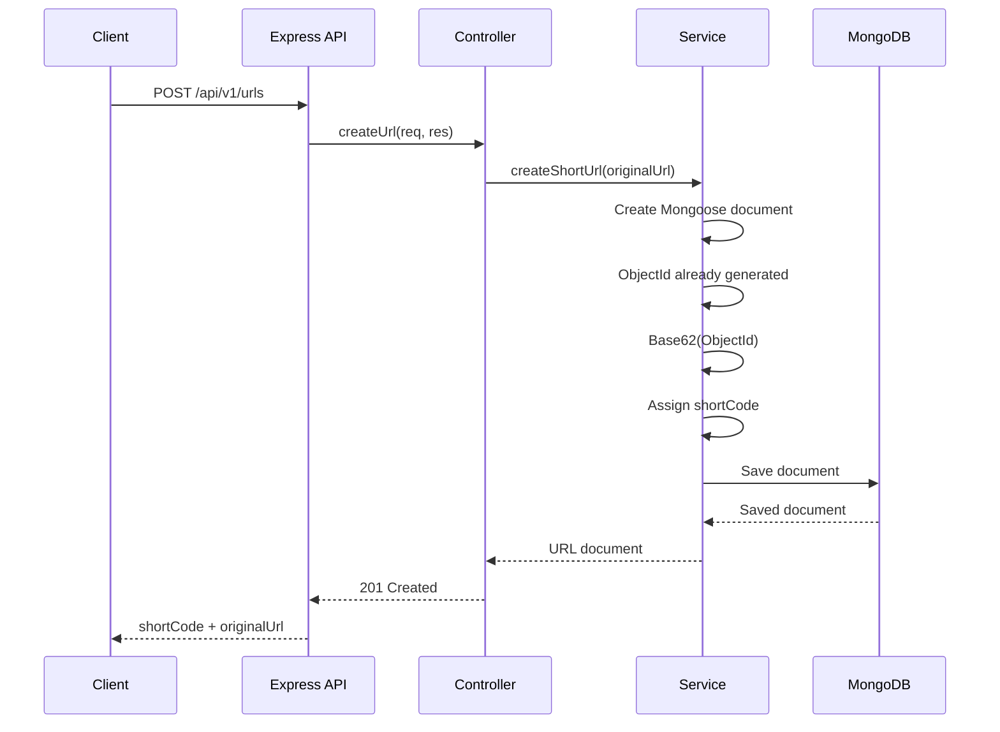
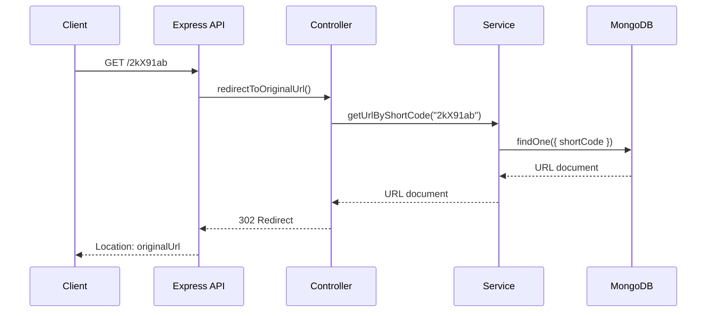
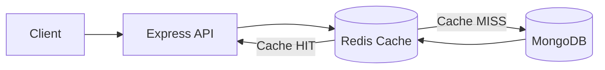
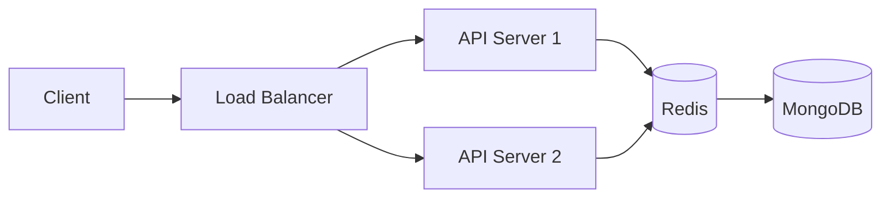
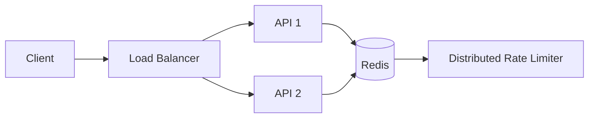
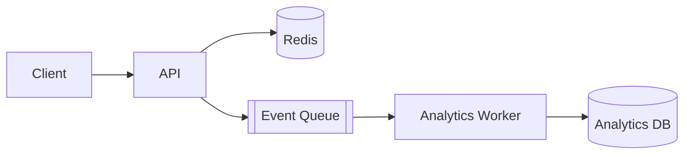
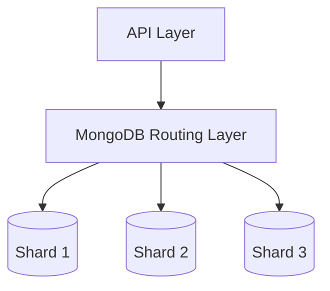

# URL Shortener — System Design Learning Project

A progressively evolving URL shortener built as a **system-design learning project**.

The goal is not just to build a working URL shortener, but to start with a simple architecture and incrementally introduce real-world distributed-system concepts such as:

- Database indexing
- Redis caching
- Horizontal API scaling
- Distributed rate limiting
- Asynchronous analytics
- Queues/workers
- MongoDB replication and sharding

The architecture is intentionally evolved version by version so that each new component is introduced to solve a concrete problem in the previous version.

---

# 1. Project Goals

The project starts with a minimal URL shortener:

```text
Client → Express API → MongoDB
```

and will progressively evolve toward:

```text
Client
   ↓
Load Balancer
   ↓
Multiple API Instances
   ↓
Redis
   ↓
MongoDB Cluster
   ↓
Async Analytics Pipeline
```

The primary learning objectives are:

1. Understand API and service boundaries.
2. Understand MongoDB data modeling.
3. Understand database indexes and query plans.
4. Understand cache-aside caching with Redis.
5. Understand horizontal scaling.
6. Understand distributed rate limiting.
7. Understand asynchronous event processing.
8. Understand workers and queues.
9. Understand MongoDB replication and sharding.
10. Understand the trade-offs behind each architectural decision.

---

# 2. Current Version

## V1 — Basic URL Shortener

Current architecture:

```text
Client
   ↓
Express API
   ↓
MongoDB
```

The V1 system supports:

- Creating a short URL.
- Generating a deterministic short code from MongoDB's `ObjectId`.
- Storing the short code and original URL.
- Redirecting a user from the short code to the original URL.

---

# 3. Planned Architecture Evolution

The project is expected to evolve through the following versions.

## V1 — Basic URL Shortener

```text
Client → Express API → MongoDB
```

Focus:

- HTTP APIs
- Express
- MongoDB
- Mongoose
- Basic CRUD
- ObjectId-based short-code generation
- Clean application structure

---

## V2 — Data Access Optimization

```text
Client → Express API → MongoDB
                              ↑
                           Indexes
```

Focus:

- MongoDB indexes
- `shortCode` lookup
- Query performance
- `COLLSCAN` vs `IXSCAN`
- `explain()`
- Read/write trade-offs

---

## V3 — Read Caching

```text
Client
   ↓
Express API
   ↓
Redis
   ↓
MongoDB
```

With cache-aside behavior:

```text
Request
   ↓
Redis
   │
   ├── HIT → Return cached URL
   │
   └── MISS
        ↓
     MongoDB
        ↓
     Redis
        ↓
     Return URL
```

Focus:

- Cache-aside pattern
- Cache keys
- TTL
- Cache hit/miss ratio
- Cache invalidation
- Reducing database reads
- Latency comparison

---

## V4 — Horizontal API Scaling

```text
                    ┌───────────┐
                    │ API 1     │
                    └─────┬─────┘
                          │
Client → Load Balancer ───┼──→ Redis → MongoDB
                          │
                    ┌─────┴─────┐
                    │ API 2     │
                    └───────────┘
```

Focus:

- Stateless API servers
- Load balancing
- Horizontal scaling
- Shared Redis state
- Multiple application instances
- Process-level scaling

---

## V5 — Distributed Rate Limiting

```text
Client
   ↓
Load Balancer
   ↓
API Instances
   ↓
Redis
   │
   └── Distributed Rate Limiter
```

Focus:

- Rate limiting
- Fixed-window algorithm
- Sliding-window algorithm
- Token bucket
- Atomic Redis operations
- Distributed coordination
- Race conditions

---

## V6 — Async Analytics

```text
                    ┌──────────────┐
                    │              │
Client → API ───────┤              ├──→ Redirect
                    │              │
                    └──────┬───────┘
                           │
                           ↓
                         Queue
                           ↓
                    Analytics Worker
                           ↓
                     Analytics DB
```

Focus:

- Events
- Queues
- Producers
- Consumers
- Workers
- Asynchronous processing
- Eventual consistency
- Retry mechanisms
- Idempotency
- Backpressure

---

## V7 — Horizontal Data Scaling

```text
                         MongoDB Cluster
                               │
                    ┌──────────┼──────────┐
                    ↓          ↓          ↓
                 Shard 1    Shard 2    Shard 3
```

Focus:

- MongoDB replication
- Sharding
- Shard keys
- Partitioning
- Hot partitions
- Horizontal database scaling
- Distributed queries

---

# 4. Technology Stack

## Backend

### Node.js

Runtime environment for executing JavaScript on the server.

### Express.js

HTTP framework used to build the REST API.

### JavaScript

Primary programming language.

### Nodemon

Development utility that automatically restarts the server when source files change.

---

## Database

### MongoDB

Primary persistent database.

MongoDB stores:

- URL documents
- Short codes
- Original URLs
- Timestamps
- Future analytics-related data where appropriate

### Mongoose

ODM used to:

- Define schemas
- Define models
- Validate documents
- Connect to MongoDB
- Query MongoDB

---

## Future Infrastructure

### Redis

Planned for:

- URL caching
- Distributed rate limiting
- Potentially short-lived counters/state

### Queue / Message Broker

Planned for asynchronous analytics.

The exact technology will be chosen when V6 is implemented.

Potential options include:

- RabbitMQ
- Kafka
- Redis Streams
- Other queue implementations

### Load Balancer

Introduced in V4 to distribute requests across multiple API instances.

---

# 5. Folder Structure

Current target structure:

```text
url-shortener/
│
├── src/
│   │
│   ├── server.js
│   ├── app.js
│   │
│   ├── config/
│   │   └── db.js
│   │
│   ├── models/
│   │   └── url.model.js
│   │
│   ├── controllers/
│   │   └── url.controller.js
│   │
│   ├── routes/
│   │   ├── url.routes.js
│   │   └── redirect.routes.js
│   │
│   ├── services/
│   │   └── url.service.js
│   │
│   └── utils/
│       └── generateShortCode.js
│
├── .env
├── .gitignore
├── package.json
├── package-lock.json
└── README.md
```

---

# 6. Responsibility of Each Layer

## `src/server.js`

Responsible for starting the application.

Responsibilities:

- Load environment variables.
- Connect to MongoDB.
- Start the HTTP server.
- Handle graceful shutdown.
- Close MongoDB connections during shutdown.

It should not contain business logic.

---

## `src/app.js`

Responsible for configuring the Express application.

Responsibilities:

- Create the Express app.
- Register middleware.
- Register routes.

Example:

```text
app.js
  │
  ├── express.json()
  │
  ├── /api/v1/urls
  │
  └── /:shortCode
```

Keeping `app.js` separate from `server.js` makes the application easier to test and easier to run in multiple instances later.

---

## `src/config/db.js`

Responsible for MongoDB connection configuration.

Example:

```js
const mongoose = require("mongoose");

const connectDB = async () => {
    try {
        await mongoose.connect(process.env.MONGODB_URI, {
            dbName: process.env.MONGODB_DB_NAME,
            maxPoolSize: 10,
            serverSelectionTimeoutMS: 5000,
        });

        console.log("MongoDB connected successfully");
    } catch (error) {
        console.error("MongoDB connection failed:", error.message);
        process.exit(1);
    }
};

module.exports = connectDB;
```

---

## `src/models/`

Contains Mongoose schemas and models.

Example:

```text
models/
└── url.model.js
```

The model defines the structure of a URL document.

---

## `src/controllers/`

Handles HTTP-specific responsibilities.

Examples:

```text
createUrl()
redirectToOriginalUrl()
```

Controllers should:

- Read request data.
- Call services.
- Decide HTTP status codes.
- Send HTTP responses.

Business logic should preferably remain in services.

---

## `src/services/`

Contains business logic.

Example:

```text
createShortUrl()
getUrlByShortCode()
```

The service layer is important because future infrastructure changes should not require putting database/cache logic directly into controllers.

For example, V3 can evolve:

```text
Service
   ↓
Redis
   ↓
MongoDB
```

without turning the controller into a large block of infrastructure logic.

---

## `src/routes/`

Defines HTTP endpoints.

### `url.routes.js`

URL creation API:

```http
POST /api/v1/urls
```

### `redirect.routes.js`

Short URL redirect:

```http
GET /:shortCode
```

---

## `src/utils/`

Contains reusable utility functions.

Current utility:

```text
generateShortCode.js
```

It converts a MongoDB ObjectId into a Base62 string.

---

# 7. V1 High-Level Design

## Architecture Diagram



---

# 8. V1 Create URL Flow

Request:

```http
POST /api/v1/urls
Content-Type: application/json

{
    "originalUrl": "https://example.com"
}
```

Flow:



---

# 9. ObjectId → Base62 Strategy

The short code is generated from MongoDB's ObjectId.

Conceptually:

```text
MongoDB ObjectId
       ↓
96-bit value
       ↓
Base62 encoding
       ↓
Short code
```

Example:

```text
ObjectId
   ↓
68cb1234567890abcdef1234
   ↓
Base62
   ↓
2kX91ab...
```

The important property is that the encoding is deterministic and one-to-one.

Therefore:

```text
ObjectId A ≠ ObjectId B
```

means:

```text
Base62(ObjectId A) ≠ Base62(ObjectId B)
```

assuming the encoder is correctly implemented.

---

# 10. Why Generate ObjectId Before Saving?

A naive implementation could be:

```text
INSERT document
     ↓
MongoDB generates _id
     ↓
Read _id
     ↓
Generate shortCode
     ↓
UPDATE document
```

That would require two database writes.

Instead, the application creates the Mongoose document first:

```js
const url = new Url({
    originalUrl,
});
```

Mongoose assigns `_id` before the document is saved.

Then:

```js
url.shortCode = generateShortCode(url._id);
```

Finally:

```js
await url.save();
```

The complete document is inserted in one write.

```text
Create ObjectId
      ↓
Generate shortCode
      ↓
Create complete document
      ↓
ONE MongoDB INSERT
```

---

# 11. V1 Data Model

A URL document looks like:

```json
{
    "_id": "ObjectId(...)",
    "shortCode": "2kX91ab...",
    "originalUrl": "https://example.com",
    "createdAt": "2026-09-19T00:00:00.000Z",
    "updatedAt": "2026-09-19T00:00:00.000Z"
}
```

Schema:

```js
const urlSchema = new mongoose.Schema(
    {
        shortCode: {
            type: String,
            required: true,
            unique: true,
            index: true,
        },

        originalUrl: {
            type: String,
            required: true,
            trim: true,
        },
    },
    {
        timestamps: true,
    }
);
```

Note: The explicit `index: true` is useful for this learning project because V2 will investigate indexing and query performance. We can later decide whether to rely on the unique index generated by `unique: true` rather than declaring both.

---

# 12. V1 Redirect Flow

Request:

```http
GET /2kX91ab
```

Flow:



---

# 13. API Endpoints

## Create Short URL

### Endpoint

```http
POST /api/v1/urls
```

### Request

```json
{
    "originalUrl": "https://example.com"
}
```

### Success Response

```http
201 Created
```

```json
{
    "shortCode": "2kX91ab...",
    "originalUrl": "https://example.com",
    "createdAt": "2026-09-19T00:00:00.000Z"
}
```

---

## Redirect

### Endpoint

```http
GET /:shortCode
```

Example:

```http
GET /2kX91ab
```

### Success

```http
302 Found
Location: https://example.com
```

---

## Short URL Not Found

```http
404 Not Found
```

```json
{
    "message": "Short URL not found"
}
```

---

# 14. Environment Variables

`.env`:

```env
PORT=3000

MONGODB_URI=mongodb+srv://<username>:<password>@<cluster>.mongodb.net/
MONGODB_DB_NAME=url_shortener
```

Never commit `.env` to Git.

`.gitignore` should include:

```gitignore
.env
node_modules/
```

---

# 15. V1 Request/Response Architecture

## Create

```text
POST /api/v1/urls
        │
        ▼
     Router
        │
        ▼
   Controller
        │
        ▼
     Service
        │
        ├── Create ObjectId
        │
        ├── Base62 encode
        │
        └── Save document
                │
                ▼
             MongoDB
```

## Redirect

```text
GET /:shortCode
        │
        ▼
     Router
        │
        ▼
   Controller
        │
        ▼
     Service
        │
        ▼
     MongoDB
        │
        ▼
   originalUrl
        │
        ▼
   HTTP 302
```

---

# 16. Why `shortCode` Is Stored

Although the short code can theoretically be derived from `_id`, it is intentionally stored in V1.

This gives the system a natural lookup key:

```js
Url.findOne({ shortCode })
```

This is useful for learning:

- Database indexing
- Query performance
- Redis caching
- Cache keys
- Rate limiting
- URL-level analytics

The short code is still derived deterministically from `_id`, so we do not need a random collision/retry mechanism.

---

# 17. Why Not Random Short Codes in V1?

An alternative is:

```text
Generate random code
       ↓
Check MongoDB
       ↓
Already exists?
   │          │
  Yes         No
   │          │
Retry        Save
```

This introduces collision handling.

Concurrent requests also mean the database must ultimately enforce uniqueness.

For this project, ObjectId → Base62 gives us:

- Deterministic generation
- No generation-time collision search
- No retry loop
- One database insert
- Simple implementation

A future version could implement a random-ID strategy as an experiment and compare the trade-offs.

---

# 18. Why V2 Needs an Index

V1 performs:

```js
Url.findOne({
    shortCode,
});
```

If MongoDB has no suitable index, it may need to scan documents.

As the collection grows:

```text
10 documents
100,000 documents
10,000,000 documents
1,000,000,000 documents
```

a full collection scan becomes increasingly expensive.

V2 introduces:

```text
shortCode index
```

Architecture:

```mermaid
flowchart LR

    Client["Client"]
    API["Express API"]
    Mongo[("MongoDB")]
    Index["Index on shortCode"]

    Client --> API
    API -->|findOne(shortCode)| Mongo
    Mongo --> Index
    Index --> Mongo
```

V2 will investigate this using MongoDB query plans and `explain()`.

---

# 19. V3 Redis Cache

Once V2 has optimized the database lookup, repeated reads can still cause unnecessary database traffic.

Example:

```text
GET /abc123
GET /abc123
GET /abc123
GET /abc123
GET /abc123
```

V3 introduces Redis:



This allows frequently accessed URLs to be served without querying MongoDB every time.

---

# 20. V4 Horizontal API Scaling

A single API instance is a bottleneck and a single point of failure.

V4 introduces multiple stateless API instances:



Because the API instances should be stateless, any request can be handled by any instance.

---

# 21. V5 Distributed Rate Limiting

Rate limiting will use shared Redis state.

Example:

```text
user:123 → request count
ip:10.0.0.1 → request count
```

Architecture:



This allows all API instances to enforce a shared rate limit.

---

# 22. V6 Async Analytics

Redirect requests should remain fast.

Instead of performing expensive analytics processing synchronously:

```text
Request
   ↓
Analytics processing
   ↓
Response
```

we introduce asynchronous processing:



Possible events:

```json
{
    "event": "url_clicked",
    "shortCode": "abc123",
    "timestamp": "2026-09-19T00:00:00Z",
    "userAgent": "...",
    "ip": "..."
}
```

The exact analytics data model will be designed when V6 is implemented.

---

# 23. V7 MongoDB Scaling

Eventually the data volume may require horizontal database scaling.

Conceptually:



Topics to investigate:

- Replica sets
- Primary/secondary architecture
- Read scaling
- Write scaling
- Shard keys
- Partition distribution
- Hot shards
- Rebalancing
- Consistency

---

# 24. Important System Design Questions

Each version should answer a specific architectural question.

## V1

> How do we build a working URL shortener?

## V2

> How do we make URL lookup efficient as the collection grows?

## V3

> How do we reduce repeated database reads?

## V4

> How do we handle more API traffic and avoid relying on one API instance?

## V5

> How do we enforce rate limits consistently across multiple API servers?

## V6

> How do we process analytics without slowing down redirects?

## V7

> How do we scale the database when a single database deployment is no longer sufficient?

---

# 25. Design Principles

The project follows several principles.

### Separation of concerns

```text
Routes
  ↓
Controllers
  ↓
Services
  ↓
Models / Infrastructure
```

### Stateless API

API servers should avoid storing request-specific state locally so that they can be horizontally scaled.

### Database as source of truth

MongoDB remains the persistent source of truth for URL mappings.

### Cache as an optimization

Redis should not initially replace MongoDB as the source of truth.

### Measure before optimizing

Each infrastructure component should be introduced because we can identify a concrete problem or bottleneck.

### Incremental complexity

Do not introduce distributed-system components before they solve a problem we understand.

---

# 26. Non-Goals for V1

V1 intentionally does not include:

- Redis
- Load balancing
- Rate limiting
- Analytics
- Message queues
- Background workers
- MongoDB sharding
- Distributed locks
- Authentication
- Authorization
- Custom domain support
- Link expiration
- User accounts
- Advanced URL validation

These may be introduced in later versions when they provide a useful system-design problem to explore.

---

# 27. Running the Project

Install dependencies:

```bash
npm install
```

Start development server:

```bash
npm run dev
```

Expected output:

```text
MongoDB connected successfully
Server is running on port 3000
```

---

# 28. Example Usage

Create a URL:

```bash
curl -X POST http://localhost:3000/api/v1/urls \
  -H "Content-Type: application/json" \
  -d '{"originalUrl":"https://www.google.com"}'
```

Example response:

```json
{
    "shortCode": "2kX91ab...",
    "originalUrl": "https://www.google.com",
    "createdAt": "2026-09-19T00:00:00.000Z"
}
```

Then visit:

```text
http://localhost:3000/2kX91ab...
```

The API responds with:

```http
302 Found
Location: https://www.google.com
```

---

# 29. Development Roadmap

```text
[x] Project setup
[x] Express server
[x] MongoDB connection
[x] Mongoose model
[x] ObjectId → Base62 short code
[x] URL creation endpoint
[x] Redirect endpoint

[ ] V2: Analyze MongoDB query
[ ] V2: Add/verify shortCode index
[ ] V2: Use explain()
[ ] V3: Add Redis
[ ] V3: Implement cache-aside
[ ] V3: Add TTL
[ ] V4: Run multiple API instances
[ ] V4: Add load balancer
[ ] V5: Distributed rate limiter
[ ] V6: Event/queue pipeline
[ ] V6: Analytics worker
[ ] V7: MongoDB replication
[ ] V7: MongoDB sharding
```

---

# 30. Learning Philosophy

The most important goal of this project is not to end up with the most complicated architecture.

The goal is to understand **why** the architecture changes.

The progression should look like:

```text
Simple system
     ↓
Identify bottleneck
     ↓
Measure / understand bottleneck
     ↓
Introduce solution
     ↓
Understand new trade-offs
     ↓
Scale
     ↓
Repeat
```

For example:

```text
MongoDB
   ↓
"Lookup is becoming expensive"
   ↓
Index
   ↓
"Repeated reads still hit MongoDB"
   ↓
Redis
   ↓
"One API instance is insufficient"
   ↓
Load Balancer + multiple instances
   ↓
"Rate limits must be shared"
   ↓
Distributed Redis limiter
   ↓
"Analytics shouldn't block redirects"
   ↓
Queue + worker
   ↓
"Database itself needs horizontal scale"
   ↓
Sharding
```

This makes each version a deliberate system-design decision rather than simply adding technologies because they are commonly used in production.
